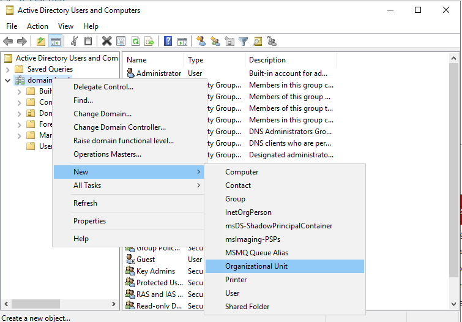
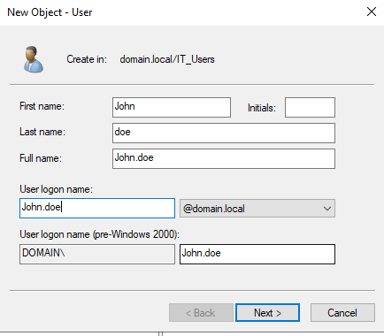
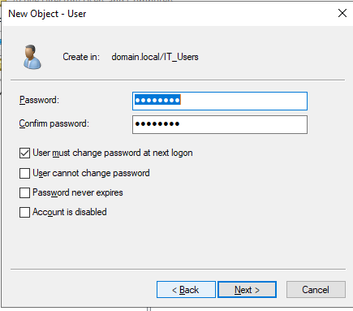
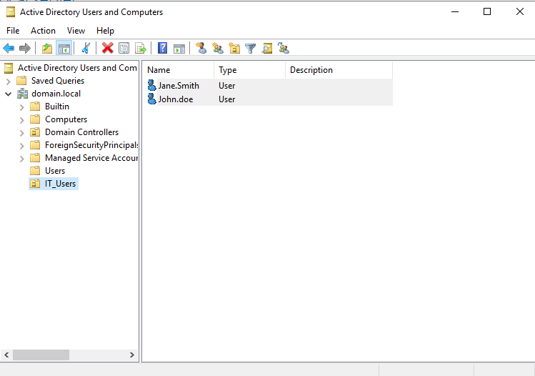
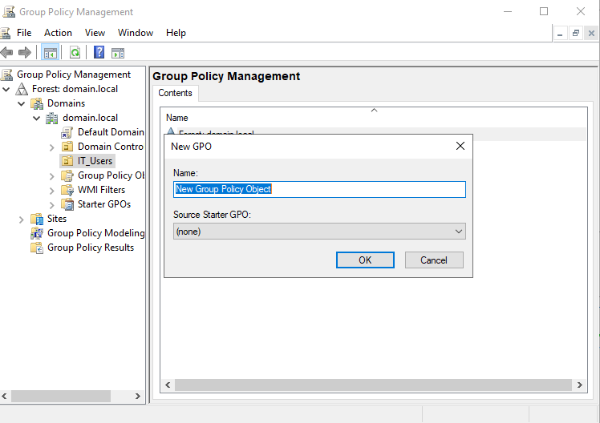
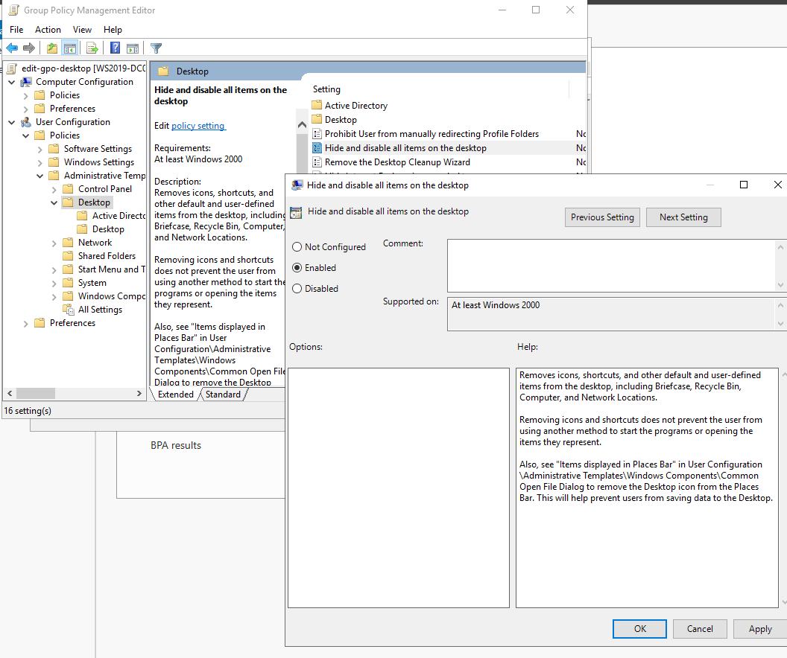
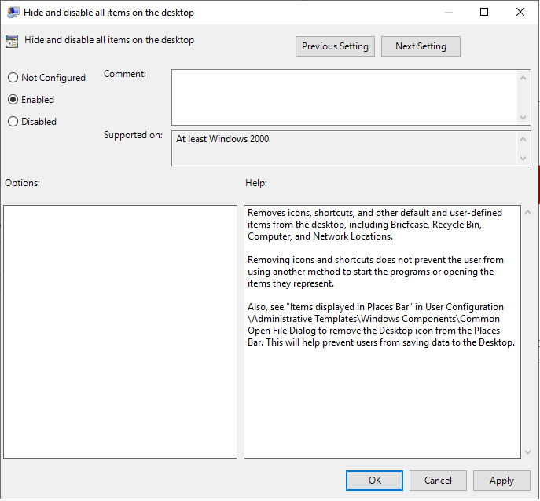

🧪 Lab 3: Create Users and Apply Group Policy

Objective

Create Active Directory (AD) users, organize them into Organizational Units (OUs), and apply basic Group Policies using the Group Policy Management Console (GPMC).

🔧 Steps to Create Users and OUs

1. Open Active Directory Users and Computers (ADUC)

Server Manager > Tools > Active Directory Users and Computers

Expand your domain: domain.local

2. Create an Organizational Unit (OU)

Right-click on your domain > New > Organizational Unit

Name it: IT_Users

3. Create Users

Right-click IT_Users OU > New > User

Enter:

First Name: John
Username: john.doe

Set password and uncheck "User must change password at next logon"

Repeat to create another user: jane.smith

🔰 Apply Group Policy to OU

1. Open Group Policy Management Console (GPMC)

Server Manager > Tools > Group Policy Management

Right-click IT_Users OU > Create a GPO in this domain, and Link it here...

Name the GPO: IT_Users_Policy

2. Edit the GPO

Right-click IT_Users_Policy > Edit

Navigate to:

User Configuration > Policies > Administrative Templates > Desktop

Enable policy: Hide and disable all items on the desktop

✅ Outcome

Two users created and grouped under IT_Users OU

GPO applied to restrict desktop access

You are ready to test user logins and confirm policy enforcement