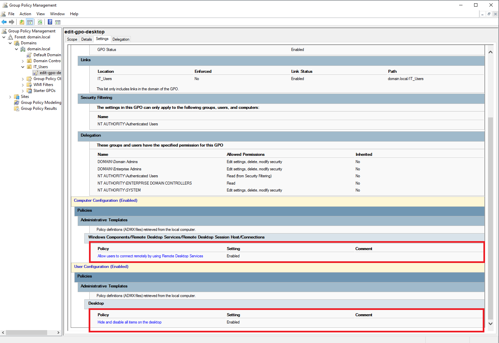

ab 3: Join Windows 10 Client to Domain
🎯 Objective
Join a Windows 10 Professional client machine to the domain.local domain and verify domain login.

🔧 Steps to Join Client to Domain
1. Prepare the Client VM
Install Windows 10 Pro (or Enterprise edition).

Assign a static IP in the same range as the server (e.g., 192.168.10.110).

Set Preferred DNS to the IP of the Domain Controller (e.g., 192.168.10.100).

2. Rename the PC (optional but recommended)
Go to System Properties → Click Change settings → Rename computer (e.g., WIN10-CLIENT)

Restart if prompted.

3. Join the Domain
Go to System Properties → Change settings → Click Domain and enter domain.local.

When prompted, enter domain credentials (e.g., domain\Administrator).

On success, you’ll see a welcome message: “Welcome to the domain.local domain.”

Restart the client.

4. Test Login
On login screen, click Other User.

Enter domain credentials (e.g., domain\testuser).

If successful, desktop loads with a domain profile.

3. Enable Remote Desktop Policy
Path:
Computer Configuration > Administrative Templates > Windows Components > Remote Desktop Services > Remote Desktop Session Host > Connections

Policy to show:
“Allow users to connect remotely using Remote Desktop Services” → Enabled

2. Add IT_Users to Remote Desktop Users Group (Restricted Groups)
Show Restricted Groups section with:

Group: Remote Desktop Users

Members: domain\IT_Users or domain\john.doe

✅ Outcome
Windows 10 machine joined to domain.local.

Verified login with domain credentials.

Confirmed client is listed in Active Directory Computers.

