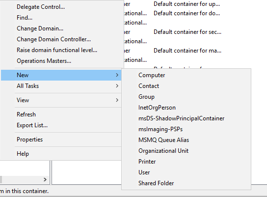
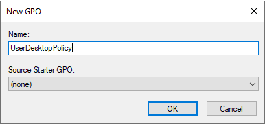
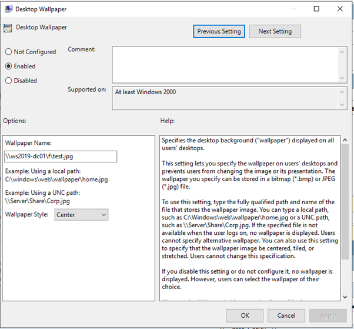
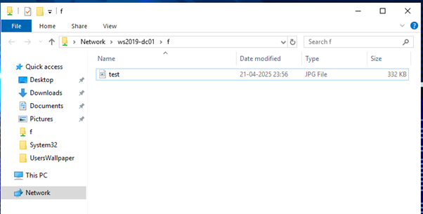
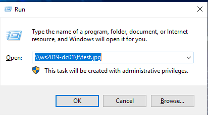
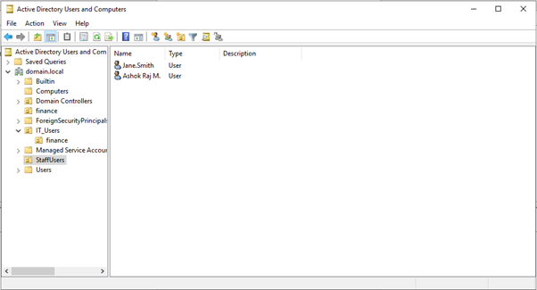
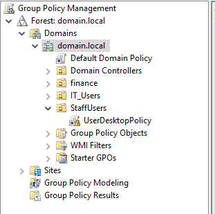
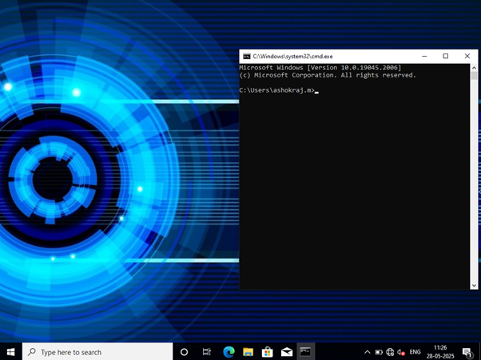

Lab 05: User Environment Management with GPOs

🧩 Objective
Configure GPOs to manage user desktop environment settings across client machines in the domain.

1. Create a New Organizational Unit (OU) for Users
Open Active Directory Users and Computers
(./images/image-43.png)
Create an OU: StaffUsers

  
Move existing domain users into this OU

3. Configure GPO for Desktop Environment
Go to Group Policy Management

Create a GPO: UserDesktopPolicy
 

Link it to the StaffUsers OU

3. Set GPO Settings
Within UserDesktopPolicy, configure:
  	
Redirect Documents folder to a network share (e.g., \\WS2019-DC01\f\test.jpg)

Set a custom desktop wallpaper via:

 
User Configuration > Administrative Templates > Desktop > Desktop > Desktop Wallpaper

4. Test on Client Machine
Log into a client PC as a user in StaffUsers

Confirm:

Folder redirection works

Wallpaper applied

5. Document with Screenshots
Take screenshots of:

OU structure in ADUC

 

GPO settings configuration

 

Client system showing applied settings  

