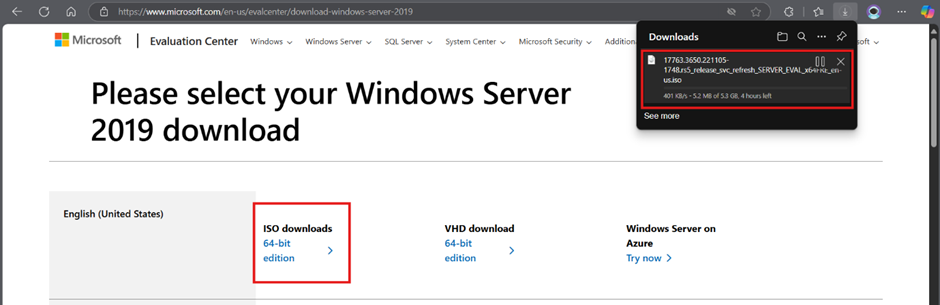
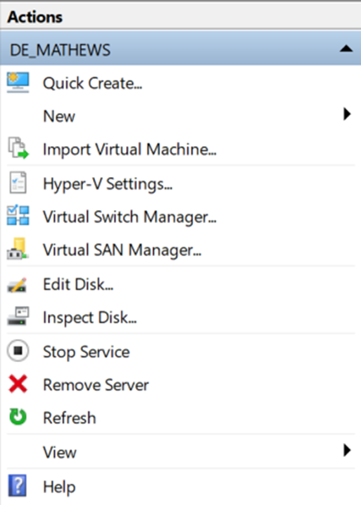
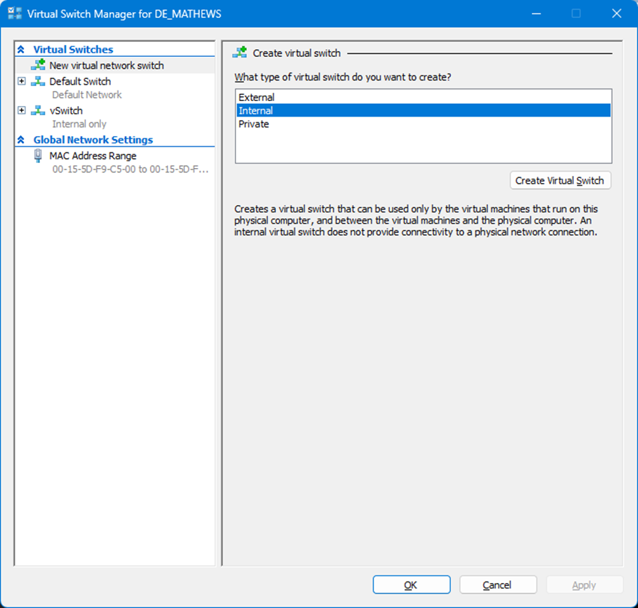
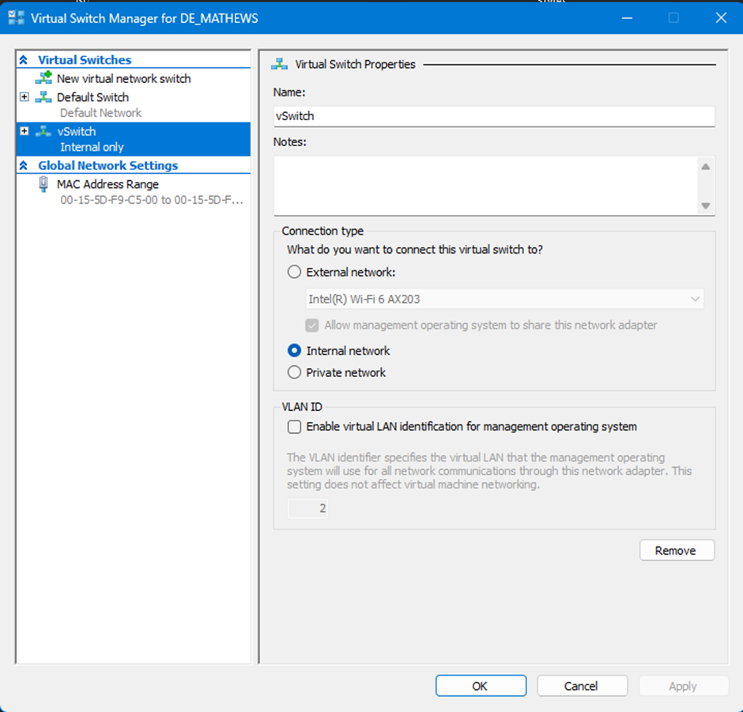

WINDOWS SERVER 2019 LAB

Requirements:
 Hyper-V or VirtualBox
- Windows Server 2019 ISO
- Windows 10/11 ISO (for client machines)
- Minimum 12 GB RAM and 100 GB disk (recommended)

Download the server 2019 ISO from the link provided: 
Windows Server 2019 Link: 
[Windows Server 2019 | Microsoft Evaluation Center](https://www.microsoft.com/en-us/evalcenter/download-windows-server-2019)

 
Now open Hyper-V or Virtual Box :

and select create a Virtual switch, and set it to Internal.

            
 

 Now apply the setting

 

In Hyper-V action bar, select New->New Virtual Machine

 

 Name and location of the VM 
 
 this is name of the machine not the actual VM
           
 Always select Generation 2 for the Generation 

Gen 2 uses UEFI (Unified Extensible Firmware Interface) instead of traditional BIOS.
More secure and faster booting.Supports Dynamic Memory more efficiently.

 

Use 4096GB RAM for the Server 

Select Switch that we created at the start

Check the Name, location and size(50GB) of the VM
 

In installation option, Select the second option and in Image, select the Windoes Server 2019 ISO

	
Now the VM Will be created and connect to the VM and follow  Basic OS installation process

Windows Server 20198 Desktop Experiance for the desktop interface 

for First time, select Custom installation

Craete new and apply. select next to install OS 

After setup the windows will restart with OS installed

Once the restart is complect. you'll set the admininstrator Password
 

In Desktop You'll see the Server Manager 

	
     

