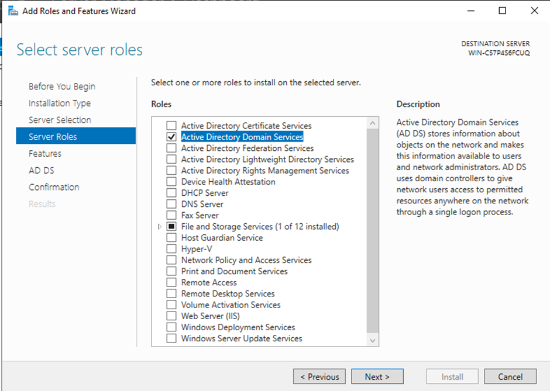
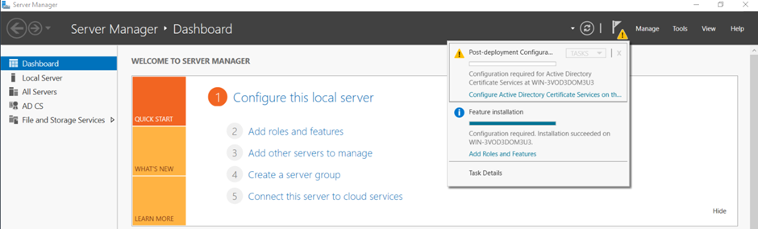
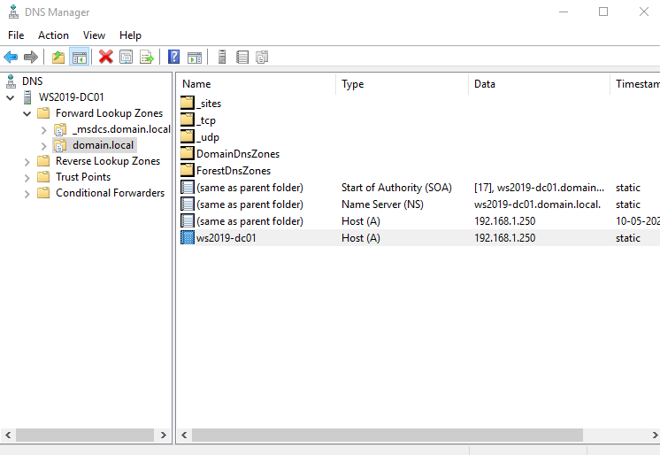

🧪 Lab 2: Promote Server to Domain Controller

Objective

Convert the Windows Server 2019 installation into a fully functioning Domain Controller (DC) with Active Directory and DNS roles.

🔧 Steps to Promote the Server

1. Install AD DS and DNS Roles

Open Server Manager → click Add roles and features.

Select Role-based or feature-based installation.

Choose the local server.

From the Roles list, check:

Active Directory Domain Services

DNS Server

Click Next through features → Install.

2. Promote Server to Domain Controller

Once installed, a yellow exclamation will appear in Server Manager.

Click "Promote this server to a domain controller".

Configuration:

Select: Add a new forest

Root domain name: domain.local

Set Directory Services Restore Mode (DSRM) password

Confirm NetBIOS name → Default is DOMAIN

Click Next, then Install. Server will reboot.

3. Post-Installation Verification

Log in as domain\Administrator

Open Active Directory Users and Computers (ADUC)

Confirm domain.local is listed

Open DNS Manager → verify forward/reverse zones

